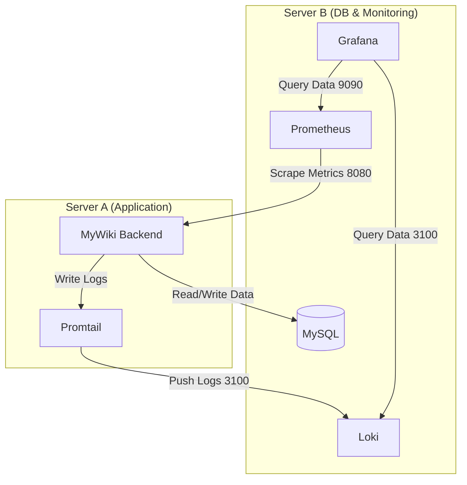

# Mywiki 서비스 Observability 구축 계획

## 다이어그램

## 1. 목표
- Spring Boot 애플리케이션의 Metrics와 Logs를 수집하여 시스템 상태를 모니터링한다.
- Grafana를 사용하여 수집된 데이터를 시각화하고 대시보드를 구축한다.
- 모니터링 시스템은 Docker Compose를 사용하여 기존 인프라와 통합하고 관리한다.

## 2. 기술 스택
- Metrics 수집: Spring Boot Actuator + Micrometer + Prometheus
- Log 수집: Logback + Loki + Promtail
- 데이터 시각화: Grafana

## 3. 실행 계획

### 3.1. Spring Boot 애플리케이션 설정 변경
- [x] 의존성 추가 (Spring Boot Actuator, Micrometer Prometheus Registry)
- [x] `application.yml` 설정 추가 (Actuator 엔드포인트 노출, 메트릭 태그)
- [ ] Logback 설정 추가 (JSON 포맷 로그, 선택 사항)

### 3.2. Docker 환경 구성
- [x] 애플리케이션 Dockerfile 생성
- [x] `docker-compose.yml` 확장 (mywiki-backend, Prometheus, Grafana, Loki, Promtail 추가)

### 3.3. 모니터링 설정 파일 생성
- [x] Prometheus 설정 파일 생성 (`monitoring/prometheus.yml`)
- [x] Promtail 설정 파일 생성 (`monitoring/promtail-config.yml`)

### 3.4. Grafana 설정 및 대시보드 구축
- [x] Grafana 접속 및 Data Source 추가 (Prometheus, Loki)
- [ ] 대시보드 생성/가져오기 (Metrics, Logs)

## 4. 향후 작업
- [ ] DB(MySQL) 모니터링 추가
- [ ] Grafana Alerting 설정을 통한 장애 알림 구축